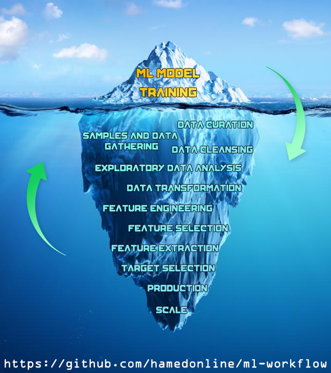

# Machine Learning Workflow - From EDA to Production

## Introduction

This repo tries to study & apply the least minimal steps involved in machine learning workflow the right way. It is compiled during the ["Machine Learning Zoomcamp"](https://datatalks.club/courses/2021-winter-ml-zoomcamp.html) course instructed by amazing [@alexeygrigorev](https://github.com/alexeygrigorev).

 

## Problem Description

The problem we will study was held as a competition on Kaggle titled as ["Allstate Claims Severity"](https://www.kaggle.com/c/allstate-claims-severity/). The data was provided by ["Allstate"](https://www.allstate.com/), a personal insurer in the United States. They were looking for ML-based methods to reduce the cost of insurance claims.
The objective of the problem is to predict _'loss'_ value for a claim, which makes it a __regression__ problem. The submissions for test data are evaluated on the __Mean Absolute Error (MAE)__ between the predicted loss and the actual loss.
All the data column values and names in provided dataset are obfuscated for the privacy reasons. Thus, we'll have no __"Domain Knowledge"__ over this problem.

    

 

## About the Dataset

The dataset used in this repo is a __"Tabular"__ one, meaning the data is represented in __rows__ and __columns__, corresponding to __samples__ and __features__ respectively. 
Data columns (features) are in both __categorical__ and __numerical__ types. Train and test datasets contain __188,318__ and __125,546__ rows (samples) respectively with __130__ columns as features, plus two more columns representing "claim id" and "target" named as _'id'_ and _'loss'_.

Regarding the dataset's availability, it is already provided in repo's <mark>__scripts/data__</mark> folder and you don't need to download it separately.

 

## Requirements

This entire repo relies on python programming language for demonstrating a machine learning workflow. Workflow steps are explained and can be run in ["Jupyter Notebook"](https://jupyter.org) documents, allowing us to execute them in an interactive environment. The easiest way to install python and many popular libraries for data science is through setting up [Anaconda](https://www.anaconda.com). You may refer to <mark>__virtual-env__</mark> folder in this repo to review a quick guide on how to setup a virtual environment without running into conflicts with your current setup.

I'd also recommend you to go through the notebooks one by one, and orderly.

 

## Important Note

For the sake of simplicity, we assume that __"Data Collection"__ step is already done since we're going to use a publicly available Kaggle dataset. Please note though, this is not the case in real-world scenarios. Most of the time, tabular data is collected by querying multiple database tables and running pretty complex SQL commands. If you're planning to become a machine learning engineer, make sure you understand and know a good deal about databases and writing efficient SQL queries; that, ladies and gents, turns out to be an essential & invaluable asset to possess for a ML engineer.

The main intention in this workflow is not achieving the best benchmark score for the subject dataset, and by no way it claims to contain the most complete sub-steps.

Given the above line you might ask, what's the focus here? I can summarize the answer with following lines:

- To take a quick look at the minimal required steps involved in a machine learning problem, from EDA to production.
- Trying to avoid common slips, and conducting each step the right way.

A good machine learning solution involves many steps; the ml algo for instance, is just tip of the iceberg. Hopefully, the material here gives you a nice view of what you should expect in your journey 😉.

    

 

Pull requests are super welcome. Please don't hesitate to contribute if you think something is missing or needs an improvement. Hope you find the content useful, and don't forget to show your support by hitting the ⭐.
